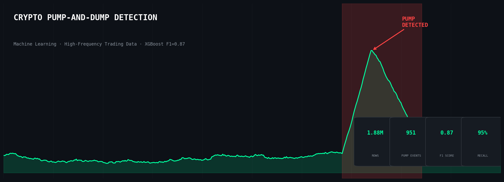

# Crypto Pump-and-Dump Detection Using Machine Learning

## Project Overview

Cryptocurrency markets are highly susceptible to coordinated pump-and-dump schemes. These schemes artificially inflate token prices before rapid sell-offs, causing significant market distortion and financial losses.

This project builds a machine learning model to detect pump-and-dump events using high-frequency trading data and time-aware validation techniques.

The problem is formulated as a **binary classification task**, where:

- 1 → Pump event  
- 0 → Normal market behavior  

Due to extreme class imbalance, special care was taken in evaluation and modeling.

---

##  Objectives

### Primary Objective
Develop a machine learning model capable of detecting cryptocurrency pump events using short time-window trading features.

### Secondary Objectives
- Handle extreme class imbalance effectively  
- Compare multiple classification models  
- Optimize classification threshold  
- Use time-based validation to prevent data leakage  
- Evaluate models using precision-recall metrics  

---

##  Dataset Description

The dataset consists of high-frequency cryptocurrency market data at:

- 5-second intervals
- 15-second intervals
- 25-second intervals

### Key Features

**Volume & Activity**
- `std_volume`
- `avg_volume`
- `std_trades`

**Price Dynamics**
- `std_price`
- `avg_price`
- `avg_price_max`

**Order Intensity**
- `std_rush_order`
- `avg_rush_order`

**Temporal Features**
- `hour_sin`, `hour_cos`
- `minute_sin`, `minute_cos`

**Target Variable**
- `gt` → 1 indicates a pump event

### Class Imbalance

Pump events represent approximately **0.0657%** of the dataset.

This severe imbalance required:
- Careful model selection
- Appropriate evaluation metrics
- Threshold tuning

---

##  Modeling Approach

### Models Compared
- Logistic Regression
- Random Forest Classifier
- XGBoost Classifier

### Validation Strategy
- Time-based train-test split
- Prevention of temporal leakage

### Evaluation Metrics
Because pump events are rare, **accuracy was not used** as the primary metric.

Instead, evaluation focused on:
- Precision (Class 1)
- Recall (Class 1)
- F1-Score (Class 1)
- Precision-Recall tradeoff

---

##  Results

### Logistic Regression
- Low precision and F1-score
- Not suitable for rare-event detection in this case

### Random Forest
- Precision: 0.71
- Recall: 0.95
- F1-Score: 0.82

### XGBoost (Selected Model)
- Precision: 0.79
- Recall: 0.95
- F1-Score: 0.87

XGBoost achieved the best balance between detecting pump events and minimizing false alarms.

---

##  Key Findings

- XGBoost is highly effective for rare-event detection in high-frequency crypto markets.
- Certain tokens appear more vulnerable to pump activity.
- Accuracy is misleading in imbalanced datasets — precision and recall provide better insight.

---

##  Business Impact

- Enables early detection of market manipulation
- Supports automated alert systems
- Reduces exposure to fraudulent price movements
- Improves market monitoring strategies

---